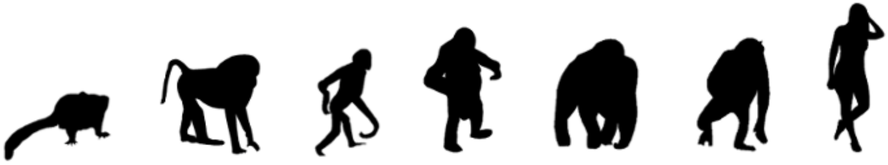

  
<b>APE</b> - Acceleration Patterns of Evolution

 

APE compares directly two information measures:
<pre>
  Normalized Compression Distance (NCD)
  Normalized Relative Compression (NRC)
</pre>
Both measures answer different questions. While the NCD measures information between strings, the NRC measures the information across strings. This leads to the problem of finding out which measure (or question) is more suitable for the answer we need.

For computing both, we use a state-of-the-art DNA sequence compressor (GeCo) that we benchmark with some top compressors in different compression modes. Then, we apply the compressor on DNA sequences with different scales and natures, first, using synthetic sequences and, then, on real DNA sequences. The last include mitochondrial DNA (mtDNA), messenger RNA (mRNA) and genomic DNA (gDNA) of seven primates.

We provide several insights into evolutionary acceleration rates at different scales, namely, the observation and confirmation across the whole genomes of a higher variation rate of the mtDNA relatively to the gDNA. We also show the importance of relative compression for localizing similar information regions using mtDNA.

 

Download:
<pre>
git clone https://github.com/pratas/APE.git
cd APE/
</pre>
Run:
<pre>
chmod +x *.sh
./runComparison.sh
./runComparisonWithRedundancy.sh
./runLocalMethod.sh
./runReferenceFreeComparison.sh
./runReferenceFreeConjoint.sh
./runRelativeCompressorsComparison.sh
./runExpectationNRC.sh
./runNC.sh
./runNRC.sh
./runNCD.sh
./runRearrange.sh
</pre>

Attention: external links, namely from NCBI repositories, may be broken with time, although they are easily fixed.

Dependencies:
<pre>
GeCo
Goose
MFCompress
GReEn
iDoComp
GDC2
</pre>
Although they are installed and used automatically.

Citation:
Pratas, D., Silva, R., Pinho, A. (2018). Comparison of Compression-Based Measures with Application to the Evolution of Primate Genomes. Entropy, 20(6), 393.

License is GPLv3.
